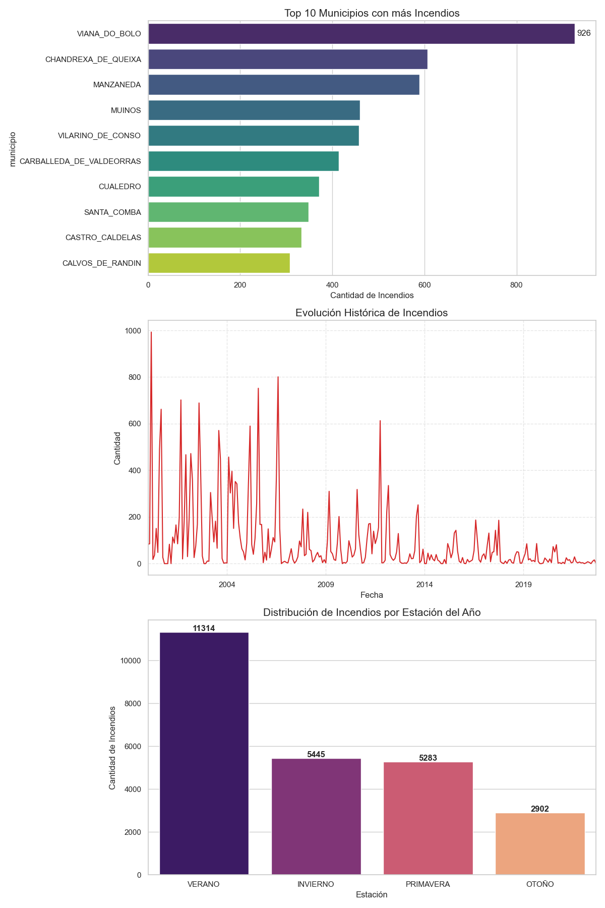

# Proyecto de Análisis y Predicción de Incendios Forestales en Galicia

[](https://github.com/alp121-ua/Proyecto-Incendios-APD)
[](LICENSE)
[](https://www.ua.es/)

Proyecto desarrollado para la asignatura **Adquisición y Preparación de Datos (APD)** del Grado en Ingeniería en Inteligencia Artificial de la Universidad de Alicante. Análisis integral de incendios forestales en Galicia mediante técnicas de procesamiento de datos, transformación RDF y visualización avanzada.

## Descripción del Proyecto

Este proyecto aborda el **análisis predictivo de incendios forestales** en la comunidad de Galicia, combinando datos históricos de incendios con variables meteorológicas para identificar patrones, factores de riesgo y apoyar la toma de decisiones en prevención y gestión de emergencias.

### Preguntas de Investigación
- ¿Dónde se producen los incendios y cuáles son las zonas de mayor prevalencia?
- ¿Han aumentado o disminuido los incendios en los últimos años?
- ¿Qué proporción de incendios son intencionados?
- ¿Cómo influyen los factores climatológicos y la época del año en la severidad de los incendios?

### Partes Interesadas
- **Cuerpos de bomberos forestales** y Unidades Militares de Emergencia (UME)
- **Agencias de protección civil** (MITECO, Xunta de Galicia)
- **Investigadores medioambientales**
- **Ciudadanía en zonas urbano-forestales**

## Objetivos

1. **Localizar, adquirir e integrar** fuentes de datos fiables sobre incendios forestales
2. **Estandarizar, limpiar y transformar** los datos utilizando Pentaho Data Integration
3. **Diseñar un almacén de datos** dimensional para análisis predictivo
4. **Transformar datos a RDF** utilizando vocabulario schema.org
5. **Crear visualizaciones interactivas** para análisis exploratorio
6. **Identificar patrones y factores de riesgo** para prevención de incendios

## Estructura del Repositorio

```
Proyecto-Incendios-APD/
├── data/                           # Datos crudos y procesados
│   ├── raw/                       # Datos originales descargados
│   ├── processed/                 # Datos limpios y transformados
│   └── rdf/                       # Datos transformados a RDF
├── docs/                          # Documentación del proyecto
│   └── MEMORIA_AYPD.docx          # Memoria completa del proyecto
├── etl/                           # Transformaciones Pentaho
│   ├── transformations/           # Archivos .ktr de PDI
│   ├── jobs/                      # Jobs de Pentaho
│   └── scripts/                   # Scripts SQL y Python auxiliares
├── database/                      # Esquemas de base de datos
│   ├── diseño_conceptual.png      # Diagrama conceptual
│   ├── diseño_logico.png          # Diagrama lógico
│   └── esquema_fisico.sql         # Script SQL del diseño físico
├── visualizations/                # Visualizaciones creadas
│   ├── mapa_incendios.html        # Mapa interactivo de incendios
│   └── analisis_temporal.html     # Análisis temporal de incendios
├── src/                           # Código fuente adicional
│   ├── rdf_generator.py           # Generador de tripletas RDF
│   └── data_validation.py         # Validaciones de datos
├── README.md                      # Este archivo
└── LICENSE                        # Licencia MIT
```

## 🛠 Tecnologías y Herramientas

### **Procesamiento de Datos**
- Pentaho Data Integration - ETL principal
- Pandas - Procesamiento adicional
- MySQL Workbench - Almacén de datos

### **Desarrollo y Visualización**
- RDF/schema.org - Transformación semántica
- Folium - Visualizaciones interactivas

## Metodología

### **1. Adquisición de Datos**
- **Incendios forestales**: Dataset "Todos los incendios forestales" de Civio (datos del Ministerio)
- **Datos meteorológicos**: Datosclima.es con 4 estaciones representativas (una por provincia gallega)
- **Periodo**: Datos filtrados desde el año 2000 para mayor relevancia

### **2. Diseño del Almacén de Datos**
- **Modelo conceptual**: Esquema en estrella centrado en el hecho INCENDIO
- **Modelo lógico**: 4 dimensiones (Fecha, Ubicación, Clima, Causa simplificada)
- **Modelo físico**: Implementación en MySQL con índices optimizados

### **3. Procesamiento ETL con Pentaho**
- **Limpieza**: Tratamiento de valores nulos, corrección de formatos
- **Transformación**: Unión de fuentes, creación de características derivadas
- **Normalización**: Estructuración según modelo dimensional
- **Validación**: Control de calidad y consistencia de datos

### **4. Transformación a RDF**
- **Vocabulario**: schema.org para representación semántica
- **Enriquecimiento**: Inclusión de metadatos contextuales
- **Validación**: Comprobación de consistencia de tripletas

### **5. Visualización**
- **Mapa interactivo**: Distribución geográfica de incendios
- **Análisis temporal**: Evolución de incendios por año y estación
- **Dashboard**: Integración de múltiples perspectivas de análisis

## Resultados y Visualizaciones

## Instalación y Uso

### **Requisitos Previos**
- Java JDK 8+
- Pentaho Data Integration 9.x
- Python 3.8+
- MySQL 8.0+

### **Configuración del Entorno**

1. **Clonar el repositorio:**
```bash
git clone https://github.com/alp121-ua/Proyecto-Incendios-APD.git
cd Proyecto-Incendios-APD
```
2. **Ejecutar transformaciones Pentaho:**
   - Abrir PDI Spoon
   - Cargar y ejecutar jobs desde `transformaciones/indendios-job1.ktl`

```


## Licencia

Este proyecto está bajo la **Licencia MIT**. Consulta el archivo [LICENSE](LICENSE) para más detalles.

## 🔗 Referencias y Recursos

1. **Fuente de datos incendios**: [Civio - Todos los incendios forestales](https://datos.civio.es/dataset/todos-los-incendios-forestales/)
2. **Fuente de datos climáticos**: [Datosclima.es](https://datosclima.es/)
3. **Vocabulario RDF**: [schema.org](https://schema.org/)
4. **Herramienta ETL**: [Pentaho Data Integration](https://www.hitachivantara.com/en-us/products/data-management-analytics/pentaho-platform/data-integration.html)
5. **Documentación técnica completa**: Disponible en `docs/MEMORIA_AYPD.docx`
